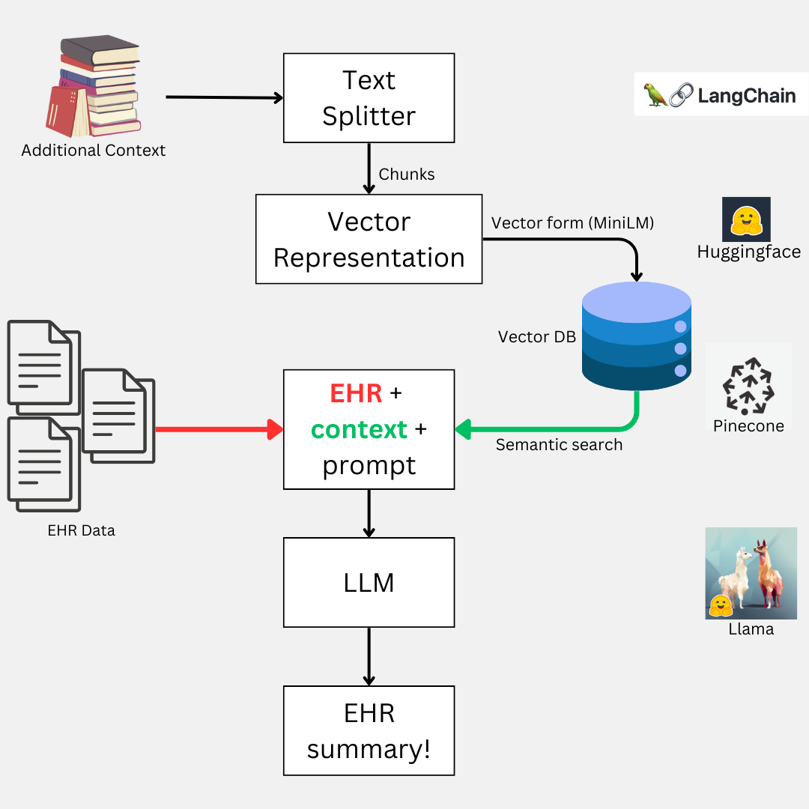
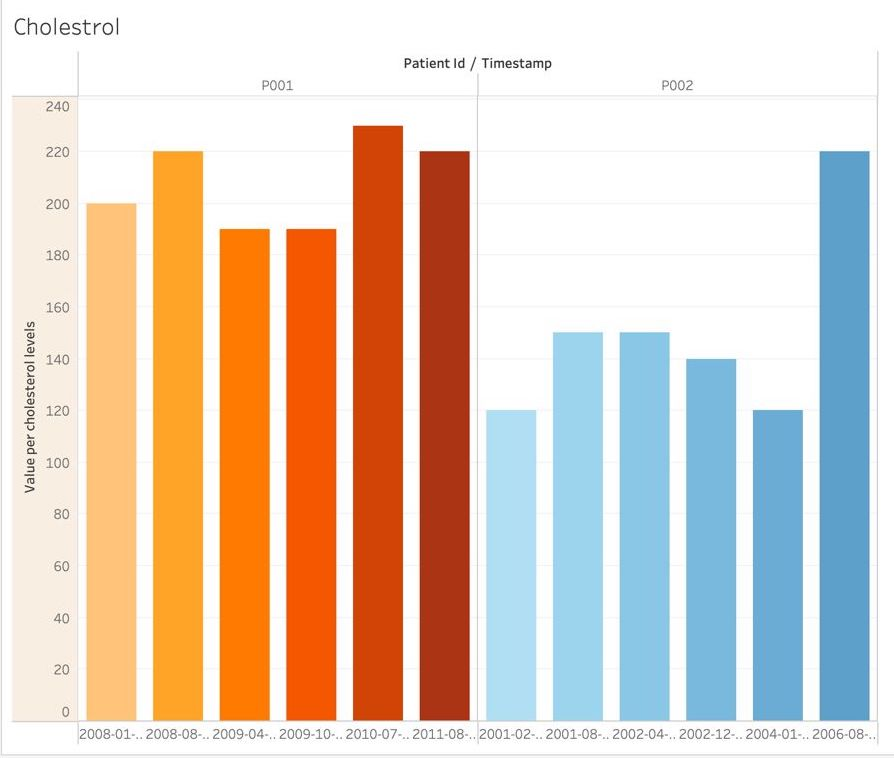

# PharmaLlama 🩺🦙
### Made with ❤️ using Llama model

## Understanding the Problem

* Clinicians typically spend an average of 16 minutes per patient encounter, dedicating a significant portion of that time to chart review (33%), documentation (24%), and ordering (17%).
* This involves going through extensive past medical reports to form conclusions.
* This process consumes valuable time that could otherwise be utilized for direct patient care or attending to other patients.
* By providing a pre-summarized version of this information, both patients and doctors can save time, ensuring that essential questions are addressed beforehand and allowing healthcare professionals to focus more efficiently on treatment solutions.

## The PharmaLlama 🩺🦙 Way

## Funtionality

* **Heart Analysis over time**: PharmaLlama incorporates longitudinal heart analysis into its functionality, allowing clinicians to track and monitor changes in a patient's cardiac health. By analyzing historical data and trends, PharmaLlama provides valuable insights into the progression of cardiovascular conditions.

* **Automated Chart Review**: PharmaLlama automates the process of reviewing extensive past medical reports by utilizing novel generative AI techniques. It efficiently extracts relevant information from diverse health parameters, providing clinicians with a pre-summarized version of a patient's medical history.
* **Time-saving Documentation**: By offering a summarized and pre-rendered version of a patient's medical history, PharmaLlama saves clinicians valuable time during patient encounters. This allows healthcare professionals to focus more efficiently on direct patient care.
* **Improved Efficiency in Healthcare Delivery**: By reducing the administrative burden on clinicians and optimizing the process of accessing and understanding medical records, PharmaLlama increases efficiency in healthcare delivery. This allows for smoother patient care workflows and better utilization of healthcare resources.
